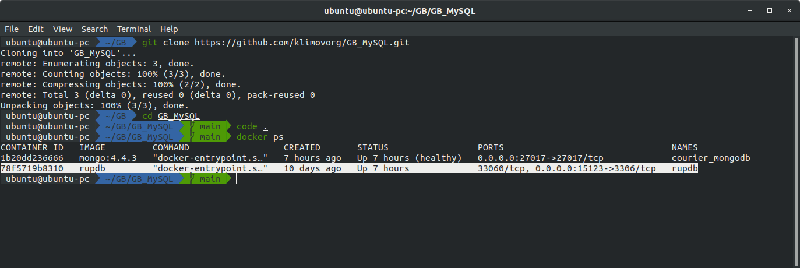
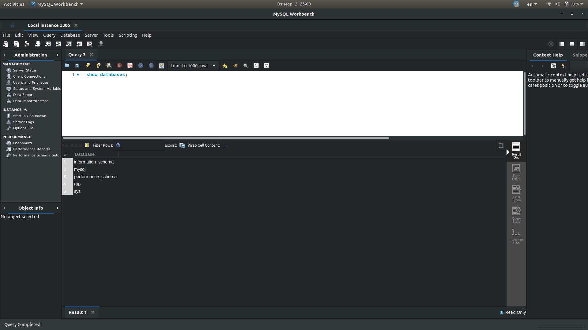

# Урок 1. Вебинар. Установка окружения. DDL - команды  

Установить рабочее окружение в соответствии с одним из описанных на уроке вариантов и приложить скриншоты подключения клиентами к серверу БД.

Рекомендуем на данном курсе все практические задния сдавать в виде ссылки на личный репозиторий на GitHub.
Для каждого урока создавать папку и размещать в ней отдельные файлы для каждой задачи.

# Решение
БД MySQL была поднята в docker контейнере.

##  Скриншот поднятой БД:
На скриншоте показан запущенный контейнер с БД  


##  Скриншот mysql workbench:


##  Dockerfile
```Dockerfile
FROM mysql:5

# init sql file
ADD rup.sql /docker-entrypoint-initdb.d

# port for db
EXPOSE 3306

ENV MYSQL_DATABASE user_name
ENV MYSQL_ROOT_PASSWORD pswd123456789
```

##  bash full update (delete all and install)
```bash
echo "stoping container..."
docker stop rupdb

echo "removal the previous version rupdb..."
docker rm rupdb

echo "removal the previous version rupdb image..."
docker rmi rupdb

echo "removal the previous database files..."
docker volume remove rupdb_vol

echo "building container..."
docker build -t rupdb .

echo "starting rupdb..."
docker run -d -p 15123:3306 -v rupdb_vol:/var/lib/mysql --restart always --name rupdb rupdb
```