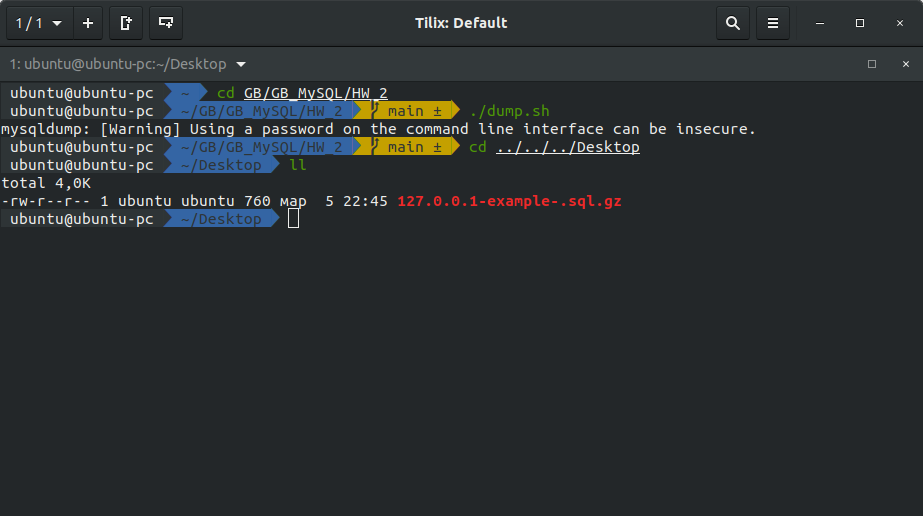

# Урок 2. Видеоурок. Управление БД. Язык запросов SQL

## Практическое задание по теме “Управление БД”
1. Установите СУБД MySQL. Создайте в домашней директории файл .my.cnf, задав в нем логин и пароль, который указывался при установке.
1. Создайте базу данных example, разместите в ней таблицу users, состоящую из двух столбцов, числового id и строкового name.
1. Создайте дамп базы данных example из предыдущего задания, разверните содержимое дампа в новую базу данных sample.
1. (по желанию) Ознакомьтесь более подробно с документацией утилиты mysqldump. Создайте дамп единственной таблицы help_keyword базы данных mysql. Причем добейтесь того, чтобы дамп содержал только первые 100 строк таблицы.

## Решение

1. БД установил. Результат в [ДЗ 1.](https://github.com/klimovorg/GB_MySQL/tree/main/HW_1)  
    Подключился с помощью команды
    ```c
    mysql -h 127.0.0.1 -P 15123 -u root -p rup
    ```
    

    Создал конфигурационный файл .my.cnf

    ```c
    [mysql]
    user=root
    password=it_is_the_secret
    host=127.0.0.1
    port=15123
    ```

    Прописал права: 
    ```bash
    chmod 0644 .my.cnf
    ```

    
      
1. 
    Создаем базу данных example
    ```sql
    CREATE DATABASE IF NOT EXISTS example
    CHARACTER SET utf8
    COLLATE utf8_general_ci;
    ```  
    Создаем таблицу users, состоящую из двух столбцов, числового id и строкового name.
    ```sql
    USE example;
    CREATE TABLE users (
	    users_id INT(6) UNSIGNED AUTO_INCREMENT PRIMARY KEY,
	    users_name VARCHAR(30));
    ```
    Добавим пару строк
    ```sql
    insert into users(users_name)
    values ('Вася'),('Петя'),('Юра'),('Маша');
    ```  
1.  Дамп БД  
    Скрипт для создания дампа БД (фаил dump.sh):
    ```bash
    #!/bin/bash

    # Настройки
    DB_BACKUP_PATH=${HOME}"/Desktop"
    MYSQL_HOST='127.0.0.1'
    MYSQL_PORT='15123'
    MYSQL_USER='root'
    MYSQL_PASSWORD='989080890898090'
    DATABASE_NAME='example'

    # Дамп (конечно же, чтобы он не ел много места, архивируем его)
    mysqldump --host=${MYSQL_HOST} \
        --port=${MYSQL_PORT} \
        --user=${MYSQL_USER} \
        --password=${MYSQL_PASSWORD} \
        ${DATABASE_NAME} | gzip > ${DB_BACKUP_PATH}/${MYSQL_HOST}-${DATABASE_NAME}-${TODAY}.sql.gz
    ``` 
    Результат: 
     

    Создаем схему:
    ```sql
        CREATE DATABASE IF NOT EXISTS sample
        CHARACTER SET utf8
        COLLATE utf8_general_ci;
    ```
    Разворачиваем дамп:
    ```bash
    #!/bin/bash

    # Настройки
    DB_BACKUP_PATH=${HOME}"/Desktop"
    MYSQL_HOST="127.0.0.1"
    MYSQL_PORT='15123'
    MYSQL_USER='root'
    MYSQL_PASSWORD='3534535345435'
    DATABASE_NAME='sample'
    DUMP_NAME="dump.sql"


    mysql -u ${MYSQL_USER} -p${MYSQL_PASSWORD} ${DATABASE_NAME} < ${DUMP_NAME};
    ```
    Проверяем:   
     

1.  Скрипт для создания дампа таблицы help_keyword из БД (фаил dump4.sh):  
    ```bash
    #!/bin/bash

    # Настройки
    DB_BACKUP_PATH=${HOME}"/Desktop"
    MYSQL_HOST='127.0.0.1'
    MYSQL_PORT='15123'
    MYSQL_USER='root'
    MYSQL_PASSWORD='879876798678'
    DATABASE_NAME='mysql'
    TABLE='help_keyword'

    # Дамп (конечно же, чтобы он не ел много места, архивируем его)
    mysqldump --host=${MYSQL_HOST} \
        --port=${MYSQL_PORT} \
        --user=${MYSQL_USER} \
        --password=${MYSQL_PASSWORD} \
        --where="1 limit 100" \
        ${DATABASE_NAME}  \
        ${TABLE} | gzip > ${DB_BACKUP_PATH}/${MYSQL_HOST}-${DATABASE_NAME}-${TODAY}.sql.gz
    ``` 
 


