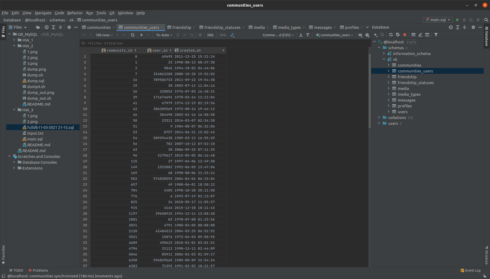
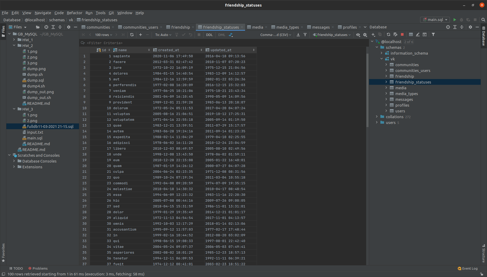

# Урок 3. Вебинар. Введение в проектирование БД

## Практическое задание
1. Создать структуру БД ВК по приложенным скриптам
2. Заполнить БД тестовыми данными любым способом (например, filldb.info)
3. (по желанию) Проанализировать структуру БД, созданной на занятии и внести предложения по усовершенствованию (с кодом)

## Решение
1. Создал структуру БД ВК по приложенным скриптам  
   Задал кодировку utf8 в CREATE DATABASE... (скрипт [main.sql](main.sql) )  
   На скриншоте показал, что все создалось успешно (таблицы все отображаются справа)
    
    Диаграмма:  
    
2. Заполнил БД тестовыми данными
   
   
   
   
   
   
   
   
   
3. Не хватает новостей, постов, "лайков" 