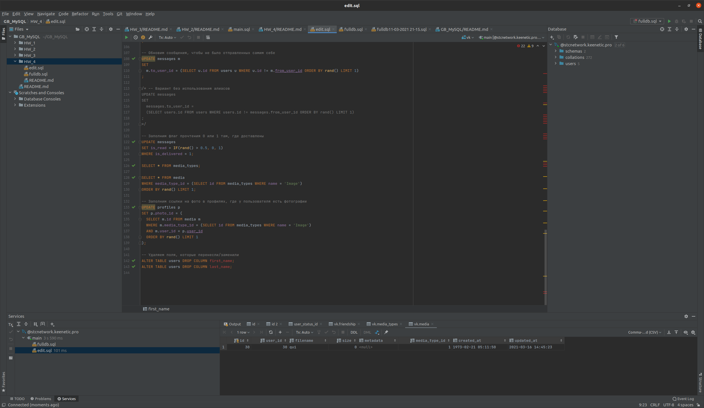

# Урок 4. Вебинар. CRUD-операции

## Практическое задание

1. Повторить все действия по доработке БД vk.
1. Заполнить новые таблицы.
1. Повторить все действия CRUD.
1. Подобрать сервис-образец для курсовой работы.

## Решение
0. Пришлось сгенерировать заново [данные](fulldb.sql), т к предыдущий дамп не был целостным
1. Повторл все действия по доработке БД vk, заполнил новые таблицы и повторить все действия CRUD..  
   Файл [SQL](edit.sql)
   
   
   В итоге [я получил такое состояние](fulldb.sql)
   
1. Подобрать сервис-образец для курсовой работы.  
   В качестве сервиса-образца я хотел бы сделать БД магазина, торгующего электронными товарами (к примеру, электронные ключи).